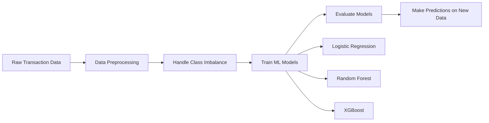

# Credit Card Fraud Detection - How to Use for Predictions

## Project Overview

This is a **machine learning project** for detecting fraudulent credit card transactions. It uses the [Kaggle Credit Card Fraud Detection dataset](https://www.kaggle.com/datasets/mlg-ulb/creditcardfraud) which contains 284,807 transactions (only 0.172% are fraudulent).

## How the Project Works



## Steps to Use This Project for Predictions

### Step 1: Install Dependencies

```bash
pip install -r requirements.txt
```

### Step 2: Run the Jupyter Notebook

```bash
jupyter notebook notebooks/fraud_detection.ipynb
```

This will:

- Download the Kaggle dataset automatically
- Explore and analyze the data
- Train multiple ML models
- Evaluate and compare their performance
- Save trained models to `outputs/models/`

### Step 3: Use Trained Models for Predictions

Once the notebook has been run, you can:

- Load saved models from `outputs/models/`
- Use them to predict fraud on new transaction data

## What the Models Predict

The models predict a **binary classification**:

- `0` = Legitimate transaction
- `1` = Fraudulent transaction

## Expected Features Required for Prediction

The model expects these 30 input features:

- `Time`: Seconds elapsed between this transaction and the first transaction
- `Amount`: Transaction amount
- `V1` to `V28`: PCA-transformed features (anonymized)

## Model Outputs

Each model provides:

- **Probability scores** (0-1) indicating likelihood of fraud
- **Binary predictions** (0 or 1) based on a threshold
- **Feature importance** rankings

## Next Steps

To actually use this for predictions, you would need to:

1. **Run the notebook** to train and save models
2. **Create a prediction script** that:
   - Loads the trained model
   - Prepares new transaction data in the correct format
   - Makes predictions
3. **Deploy** the model for real-time or batch predictions

---

**Note**: This is an educational project. For production fraud detection systems, you would need additional components like:

- Real-time API endpoints
- Model monitoring and retraining
- Data pipelines
- Integration with payment systems
